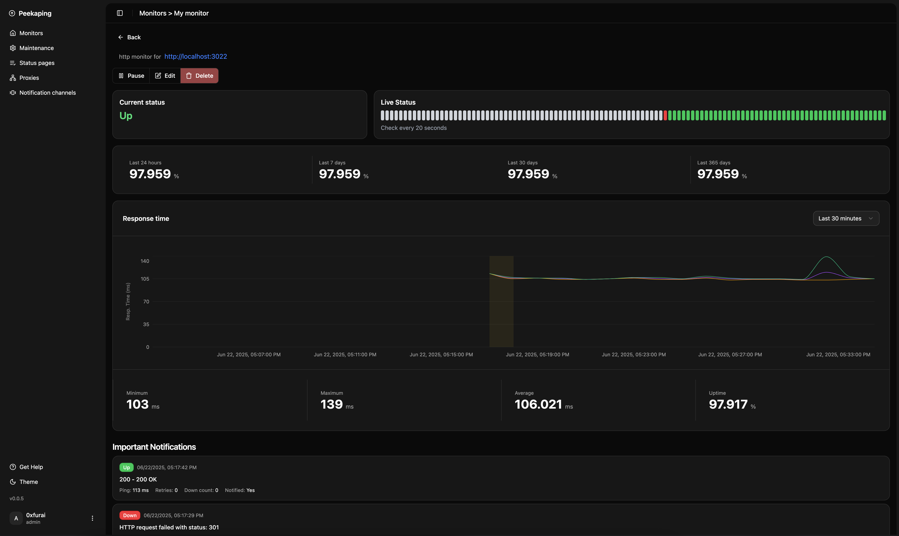
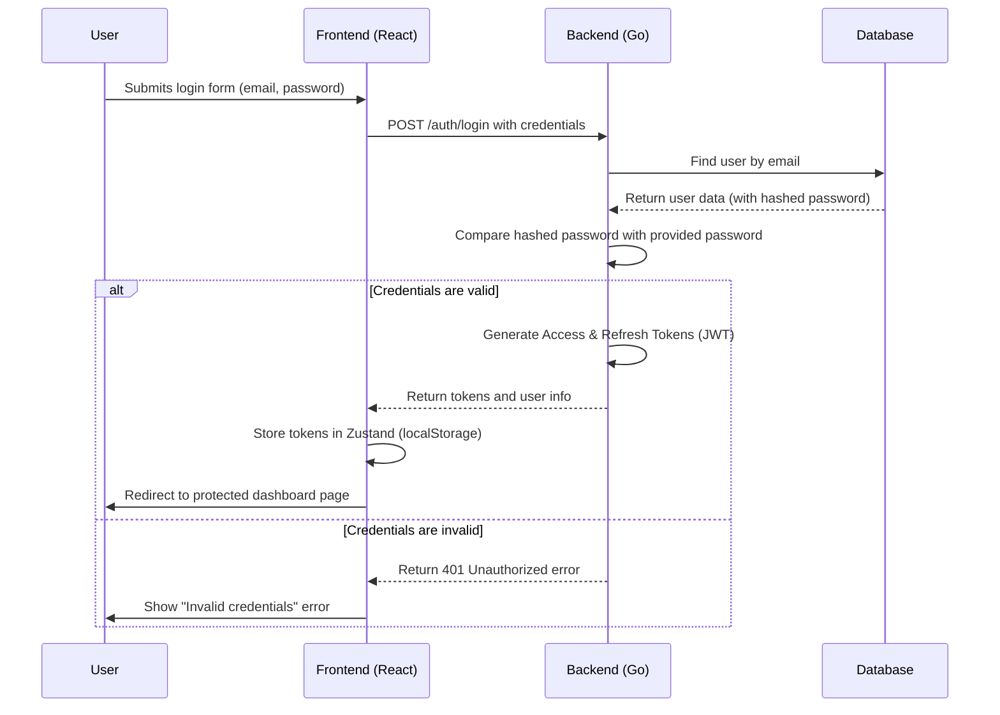

# Vigi - the best uptime kuma alternative


**A modern, self-hosted uptime monitoring solution**

Vigi is a uptime monitoring system built with Golang and React. You can monitor your websites, API and many more leveraging beautiful status pages, alert notifications.

🔗 Website **[vigi.run](https://vigi.run)**

🔗 Live Demo **[demo.vigi.run](https://demo.vigi.run)**

🔗 Documentation **[docs.vigi.run](https://docs.vigi.run)**

🔗 Community terraform provider **[registry.terraform.io/providers/tafaust/vigi](https://registry.terraform.io/providers/tafaust/vigi/latest)**

## Why Vigi Is the Best Alternative to Uptime Kuma

- API first architecture
- easy to extend server architecture
- Server written in golang that make it fast and lightweight using minimum RAM and CPU
- high stability thanks to typed client and compiled golang
- clean and modern ui design
- flexible storage options: SQLite / PostgreSQL / MongoDB
- API keys management and access control

## ⚠️ Beta Status

**Vigi is currently in beta and actively being developed.**
Please note:

- The software is still under active development
- Some features could be changed
- I recommend testing in non-production environments first
- Please report any issues you encounter - your feedback helps us improve!

Please try Vigi and provide feedback, this is huge contribution for us! Let's make Vigi production ready.

## Quick start (docker + SQLite)

```bash
docker run -d --restart=always \
  -p 8383:8383 \
  -e DB_NAME=/app/data/vigi.db \
  -v $(pwd)/.data/sqlite:/app/data \
  --name vigi \
  vigirun/vigi-bundle-sqlite:latest
```

[Docker + SQLite Setup](https://docs.vigi.run/self-hosting/docker-with-sqlite)

Vigi also support [PostgreSQL Setup](https://docs.vigi.run/self-hosting/docker-with-postgres) and [MongoDB Setup](https://docs.vigi.run/self-hosting/docker-with-mongo). Read docs for more guidance

## ⚡ Features

### Available Monitors

- HTTP/HTTPS
- TCP
- Ping (ICMP)
- DNS
- Push (incoming webhook)
- Docker container
- gRPC
- SNMP
- PostgreSQL
- Microsoft SQL Server
- MongoDB
- Redis
- MySQL/MariaDB -
- MQTT Broker
- RabbitMQ
- Kafka Producer

### 🔔 Alert Channels

- Email (SMTP)
- Webhook
- Telegram
- Slack
- Google Chat
- Signal
- Mattermost
- Matrix
- Discord
- WeCom
- WhatsApp (WAHA)
- PagerDuty
- Opsgenie
- Grafana OnCall
- NTFY
- Gotify
- Pushover
- SendGrid
- Twilio
- LINE Messenger
- PagerTree
- Pushbullet

### ✨ Other

- Beautiful Status Pages
- SVG Status Badges
- Multi-Factor Authentication (MFA)
- Brute-Force Login Protection
- SSL Certificate Expiration Checks

## 💡 Motivation behind creating uptime kuma alternative

Vigi was deeply inspired by Uptime Kuma. We tried to cover all the fundamental flaws of Uptime Kuma. Alternative was to build new system with features community love and request but using typed approaches applying extendable architecture. First of all - we are API first. Our server side written in Golang, fast and efficient language that works with minimal RAM. Architecture allows easily extend system adding new notification channels, monitor types etc.

Client side written with React and typescript that makes it reliable and fast. Client side is also easily extensible.

Vigi an ideal choice for teams who need a reliable, customizable uptime monitoring solution.



## Authentication Flow

Below is a sequence diagram illustrating the complete authentication flow, from user login to accessing a protected page.



## 📡 Stay in the Loop

I share quick tips, dev-logs, and behind-the-scenes updates on&nbsp;Twitter.
If you enjoy this project, come say hi &amp; follow along!

## 🚧 Development roadmap

### General

- [ ] Incidents
- [ ] Migration tool (from uptime kuma)
- [ ] Multi user, groups, access levels
- [ ] Group monitors
- [ ] Add support for Homepage widget (in progress)
- [ ] Gatus like conditions

### Monitors

- [ ] HTTPs keyword and JSON query
- [ ] Steam
- [ ] GameDig
- [ ] Playwrite

### Notification channels

- [ ] Microsoft Teams
- [ ] WhatsApp (Whapi)
- [ ] CallMeBot (WhatsApp, Telegram Call, Facebook Messanger)
- [ ] AliyunSMS (阿里云短信服务)
- [ ] DingDing (钉钉)
- [ ] ClickSend SMS
- [ ] Rocket.Chat


## 🤝 Contributing

We welcome contributions! Please:

1. Fork the repository
2. Create a feature branch
3. Make your changes
4. Add tests if applicable
5. Submit a pull request

## Star History

[](https://www.star-history.com/#vigi-run/vivi&type=date&legend=top-left)

## 📝 License

This project is licensed under the MIT License - see the [LICENSE](LICENSE) file for details.

## 🙏 Acknowledgments

- Inspired by [Uptime Kuma](https://github.com/louislam/uptime-kuma)
- Built with amazing open-source technologies
- Thanks to all contributors and users

## 📞 Support

- **Issues**: Report bugs and request features via GitHub Issues

---

**Made with ❤️ by the Vigi team**
